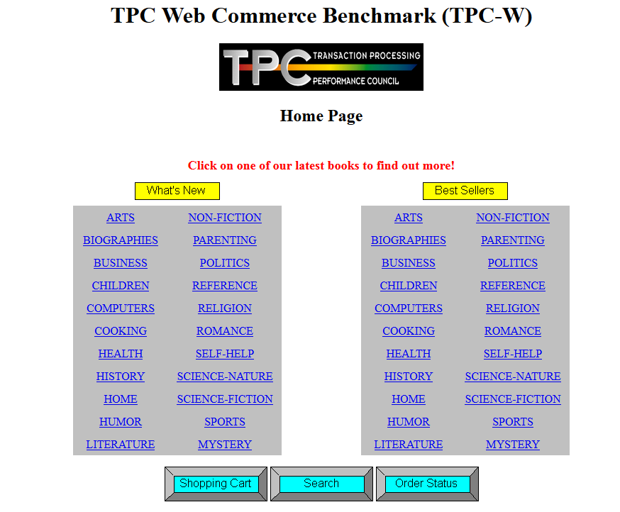

Project Tutor: Peter

Project Member:Cuiqing Li

Update Time:3/23/2017

### Description of the project:
This is a project which is used to simulate a large scale E-Commerce. Also, I am going to use Java to implement this project based on based on TPCW benchmark and classical multi-tier architecture. The platform has following properties: Client Emulator, Distributed Database System, back-end monitor system, read in and write out controlling system. 

Here is the general view of the front-end, and the structure design referenced from TPC-W demo:

### Software Installation:
## elasticDB node setup
* set master and slaves in set_env.sh
* make sure you have installed mysql 5.5 on all the nodes in the queues. 
* make sure that you have cloned tpcw in lesson 1
* make sure those nodes in the queues have root access to each other without passwd (lesson 2)

## elasticDB eclipse setup and debug
* import code to your eclipse
* install mvn plugin in eclipse
* run mvn eclipse:eclipse and mvn dependency:resolve

## elasticDB property (lesson 3)
* modify the scripts/set_env.sh to set the MASTER, SLAVE and CANDIDATE
* modify the scripts/set_env.sh to set the server that we would like to destroy (to test availability)

## elasticDB experiment setup (do this before you run each time)
* ./testConnection to test the access of each other
* ./prepareMasterSlaves to get ready for master, slave and candidates.

## elasticDB run
* From eclipse, just run without any parameter
* Or, from eclipse, in order to test scalability run with -c 
* Or, from eclipse, in order to test availability and scalability run with -c -d
* Or, you can also run from CommandLine accordingly

## elasticDB monitor
* run ./enableMonitors.sh, this will run dstats and open windows for MASTER, SLAVE and CANDIDATE
* open your browser to point to monitorIp:8080/WebContent/elasticdb.jsp

### Resource Referenced:
* Installer and customization from: http://tpcw.deadpixel.de/
* PostgreSQL changes from: http://pharm.ece.wisc.edu/tpcw/tpcw-postgresql.html
* Original available at: http://pharm.ece.wisc.edu/tpcw.shtml

For installation and usage instructions see http://tpcw.deadpixel.de/
Alternative results analysis using Python at: https://gist.github.com/4086237

